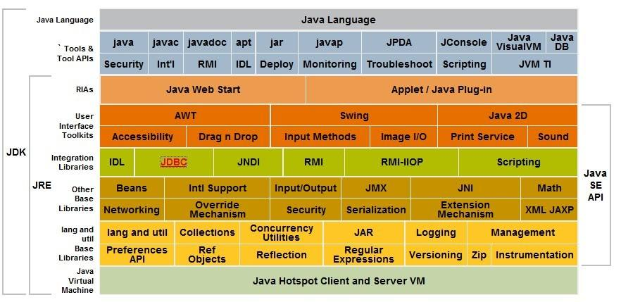

<svg id="kity_svg_6" xmlns="http://www.w3.org/2000/svg" xmlns:xlink="http://www.w3.org/1999/xlink" version="1.1" width="1014" height="361" style="visibility: visible; background: rgb(251, 251, 251);" viewBox="0 0 1014 361"><defs id="kity_defs_7"><linearGradient id="kity_linearGradient_17" x1="0" y1="0" x2="0" y2="1"><stop id="kity_stop_18" offset="0" stop-color="rgb(255, 255, 255)"></stop><stop id="kity_stop_19" offset="1" stop-color="rgb(204, 204, 204)"></stop></linearGradient><marker id="kity_marker_4" orient="auto" refX="6" refY="0" viewBox="-7 -7 14 14" markerWidth="7" markerHeight="7" markerUnits="userSpaceOnUse"><path id="kity_path_5" fill="rgb(115, 161, 191)" stroke="none" d="M6,0A6,6,0,1,1,-6,0A6,6,0,1,1,6,0"></path></marker><marker id="kity_marker_2" orient="auto" refX="6" refY="0" viewBox="-7 -7 14 14" markerWidth="7" markerHeight="7" markerUnits="userSpaceOnUse"><path id="kity_path_3" fill="rgb(115, 161, 191)" stroke="none" d="M6,0A6,6,0,1,1,-6,0A6,6,0,1,1,6,0"></path></marker></defs><g id="kity_g_8"><g id="minder1" text-rendering="optimize-speed"><g id="minder_connect_group1"><path id="kity_path_31" fill="none" stroke="rgb(115, 161, 191)" stroke-width="1" d="M100,178.5A65.5,44,0,0,1,165.5,134.5"></path><path id="kity_path_144" fill="none" stroke="rgb(115, 161, 191)" stroke-width="1" d="M100,178.5A18.5,117,0,0,0,118.5,295.5"></path><path id="kity_path_182" fill="none" stroke="rgb(115, 161, 191)" stroke-width="1" d="M316.5,134.5C336.5,134.5,336.5,86.5,356.5,86.5"></path><path id="kity_path_187" fill="none" stroke="rgb(115, 161, 191)" stroke-width="1" d="M316.5,134.5C336,134.5,336,193.5,355.5,193.5"></path><path id="kity_path_190" fill="none" stroke="rgb(115, 161, 191)" stroke-width="1" d="M631.5,86.5C652,86.5,652,57.5,672.5,57.5"></path><path id="kity_path_191" fill="none" stroke="rgb(115, 161, 191)" stroke-width="1" d="M631.5,86.5C651.5,86.5,651.5,99.5,671.5,99.5"></path><path id="kity_path_192" fill="none" stroke="rgb(115, 161, 191)" stroke-width="1" d="M631.5,86.5C652.5,86.5,652.5,142.5,673.5,142.5"></path><path id="kity_path_193" fill="none" stroke="rgb(115, 161, 191)" stroke-width="1" d="M424.5,86.5C444.5,86.5,444.5,86.5,464.5,86.5"></path><path id="kity_path_206" fill="none" stroke="rgb(115, 161, 191)" stroke-width="1" d="M423.5,193.5C444.5,193.5,444.5,123.5,465.5,123.5"></path><path id="kity_path_207" fill="none" stroke="rgb(115, 161, 191)" stroke-width="1" d="M423.5,193.5C443.5,193.5,443.5,167.5,463.5,167.5"></path><path id="kity_path_208" fill="none" stroke="rgb(115, 161, 191)" stroke-width="1" d="M423.5,193.5C443.5,193.5,443.5,219.5,463.5,219.5"></path><path id="kity_path_209" fill="none" stroke="rgb(115, 161, 191)" stroke-width="1" d="M423.5,193.5C444.5,193.5,444.5,267.5,465.5,267.5"></path><path id="kity_path_210" fill="none" stroke="rgb(115, 161, 191)" stroke-width="1" d="M867.5,57.5C887.5,57.5,887.5,31.5,907.5,31.5"></path><path id="kity_path_211" fill="none" stroke="rgb(115, 161, 191)" stroke-width="1" d="M867.5,57.5C887.5,57.5,887.5,83.5,907.5,83.5"></path></g><g id="minder_node1"><path id="node_outline1" fill="rgb(115, 161, 191)" stroke="rgb(57, 80, 96)" d="M25.5,158.5h149a5,5,0,0,1,5,5v30a5,5,0,0,1,-5,5h-149a5,5,0,0,1,-5,-5v-30a5,5,0,0,1,5,-5z" stroke-width="3"></path><g id="node_text1" fill="white"><text id="kity_text_22" text-rendering="inherit" font-size="16" dy=".8em" y="170.5" x="44.5">第1章 走近Java</text></g></g><g id="kity_g_14" display="none"><path id="kity_path_15" fill="rgba(0, 92, 153, 0.5)" stroke="none" d="M671.5,115.5h69v15h-69z"></path><path id="kity_path_16" fill="none" stroke="rgb(0, 76, 128)" d="M671.5,115.5L740.5,115.5" stroke-width="1"></path></g><g id="minder_node2" opacity="1"><g id="node_expander13" style="cursor: pointer;"><path id="kity_path_138" fill="white" stroke="gray" d="M166.5,134.5A6,6,0,1,1,154.5,134.5A6,6,0,1,1,166.5,134.5"></path><path id="kity_path_139" fill="none" stroke="gray" d="M156,134.5L165,134.5"></path></g><path id="node_outline14" fill="rgb(238, 243, 246)" stroke="rgb(115, 161, 191)" d="M170.5,121.5h143a3,3,0,0,1,3,3v20a3,3,0,0,1,-3,3h-143a3,3,0,0,1,-3,-3v-20a3,3,0,0,1,3,-3z" stroke-width="1"></path><g id="node_text14" fill="black"><text id="kity_text_83" text-rendering="inherit" font-size="14" dy=".8em" y="127.5" x="187.5">1.2 Java技术体系</text></g></g><g id="minder_node16" opacity="1"><g id="node_expander15" style="cursor: pointer;" display="none"><path id="kity_path_150" fill="white" stroke="gray" d="M119.5,295.5A6,6,0,1,1,107.5,295.5A6,6,0,1,1,119.5,295.5"></path><path id="kity_path_151" fill="none" stroke="gray"></path></g><path id="node_outline16" fill="rgb(238, 243, 246)" stroke="rgb(115, 161, 191)" d="M123.5,249.5h234a3,3,0,0,1,3,3v86a3,3,0,0,1,-3,3h-234a3,3,0,0,1,-3,-3v-86a3,3,0,0,1,3,-3z" stroke-width="1"></path><g id="node_text16" fill="black"><text id="kity_text_146" text-rendering="inherit" font-size="14" dy=".8em" y="321.5" x="192.5">1.3 Java发展史</text></g><image id="kity_image_147" xmlns:xlink="http://www.w3.org/1999/xlink" xlink:href="http://kityminder-img.gz.bcebos.com/32fb286d6c826eee2daebcca36bd7f457343644a" x="140.5" y="255.5" width="200" height="61"></image></g><g id="minder_node3" opacity="1"><g id="node_expander7" style="cursor: pointer;"><path id="kity_path_120" fill="white" stroke="gray" d="M356.5,86.5A6,6,0,1,1,344.5,86.5A6,6,0,1,1,356.5,86.5"></path><path id="kity_path_121" fill="none" stroke="gray" d="M346,86.5L355,86.5"></path></g><path id="node_outline8" fill="none" stroke="none" d="M361.5,75.5h58a5,5,0,0,1,5,5v12a5,5,0,0,1,-5,5h-58a5,5,0,0,1,-5,-5v-12a5,5,0,0,1,5,-5z" stroke-width="3"></path><g id="node_text8" fill="black"><text id="kity_text_71" text-rendering="inherit" font-size="12" dy=".8em" y="80.5" x="366.5">功能划分</text></g></g><g id="minder_node10" opacity="1"><g id="node_expander12" style="cursor: pointer;"><path id="kity_path_135" fill="white" stroke="gray" d="M355.5,193.5A6,6,0,1,1,343.5,193.5A6,6,0,1,1,355.5,193.5"></path><path id="kity_path_136" fill="none" stroke="gray" d="M345,193.5L354,193.5"></path></g><path id="node_outline13" fill="none" stroke="none" d="M360.5,182.5h58a5,5,0,0,1,5,5v12a5,5,0,0,1,-5,5h-58a5,5,0,0,1,-5,-5v-12a5,5,0,0,1,5,-5z" stroke-width="3"></path><g id="node_text13" fill="black"><text id="kity_text_81" text-rendering="inherit" font-size="12" dy=".8em" y="187.5" x="365.5">领域划分</text></g></g><g id="minder_node5" opacity="1"><g id="node_expander3" style="cursor: pointer;"><path id="kity_path_108" fill="white" stroke="gray" d="M672.5,57.5A6,6,0,1,1,660.5,57.5A6,6,0,1,1,672.5,57.5"></path><path id="kity_path_109" fill="none" stroke="gray" d="M662,57.5L671,57.5"></path></g><path id="node_outline4" fill="none" stroke="none" d="M677.5,46.5h185a5,5,0,0,1,5,5v12a5,5,0,0,1,-5,5h-185a5,5,0,0,1,-5,-5v-12a5,5,0,0,1,5,-5z" stroke-width="3"></path><g id="node_text4" fill="black"><text id="kity_text_63" text-rendering="inherit" font-size="12" dy=".8em" y="51.5" x="682.5">JRE(Java Runtime Environment)</text></g></g><g id="minder_node8"><g id="node_expander4" style="cursor: pointer;" display="none"><path id="kity_path_111" fill="white" stroke="gray" d="M671.5,99.5A6,6,0,1,1,659.5,99.5A6,6,0,1,1,671.5,99.5"></path><path id="kity_path_112" fill="none" stroke="gray"></path></g><path id="node_outline5" fill="none" stroke="none" d="M676.5,88.5h59a5,5,0,0,1,5,5v12a5,5,0,0,1,-5,5h-59a5,5,0,0,1,-5,-5v-12a5,5,0,0,1,5,-5z"></path><g id="node_text5" fill="black"><text id="kity_text_65" text-rendering="inherit" font-size="12" dy=".8em" y="93.5" x="681.5">Java语言</text></g></g><g id="minder_node9" opacity="1"><g id="node_expander5" style="cursor: pointer;" display="none"><path id="kity_path_114" fill="white" stroke="gray" d="M673.5,142.5A6,6,0,1,1,661.5,142.5A6,6,0,1,1,673.5,142.5"></path><path id="kity_path_115" fill="none" stroke="gray"></path></g><path id="node_outline6" fill="none" stroke="none" d="M678.5,131.5h58a5,5,0,0,1,5,5v12a5,5,0,0,1,-5,5h-58a5,5,0,0,1,-5,-5v-12a5,5,0,0,1,5,-5z" stroke-width="3"></path><g id="node_text6" fill="black"><text id="kity_text_67" text-rendering="inherit" font-size="12" dy=".8em" y="136.5" x="683.5">Java API</text></g></g><g id="minder_node4"><g id="node_expander6" style="cursor: pointer;"><path id="kity_path_117" fill="white" stroke="gray" d="M464.5,86.5A6,6,0,1,1,452.5,86.5A6,6,0,1,1,464.5,86.5"></path><path id="kity_path_118" fill="none" stroke="gray" d="M454,86.5L463,86.5"></path></g><path id="node_outline7" fill="none" stroke="none" d="M469.5,75.5h157a5,5,0,0,1,5,5v12a5,5,0,0,1,-5,5h-157a5,5,0,0,1,-5,-5v-12a5,5,0,0,1,5,-5z"></path><g id="node_text7" fill="black"><text id="kity_text_69" text-rendering="inherit" font-size="12" dy=".8em" y="80.5" x="474.5">JDK(Java Development Kit)</text></g></g><g id="kity_g_12" display="none"><path id="kity_path_13" fill="none" stroke="rgb(66, 94, 112)" d="M469.5,75.5h157a5,5,0,0,1,5,5v12a5,5,0,0,1,-5,5h-157a5,5,0,0,1,-5,-5v-12a5,5,0,0,1,5,-5z" stroke-width="5"></path></g><g id="minder_node11" opacity="1"><g id="node_expander8" style="cursor: pointer;" display="none"><path id="kity_path_123" fill="white" stroke="gray" d="M465.5,123.5A6,6,0,1,1,453.5,123.5A6,6,0,1,1,465.5,123.5"></path><path id="kity_path_124" fill="none" stroke="gray"></path></g><path id="node_outline9" fill="none" stroke="none" d="M470.5,112.5h65a5,5,0,0,1,5,5v12a5,5,0,0,1,-5,5h-65a5,5,0,0,1,-5,-5v-12a5,5,0,0,1,5,-5z" stroke-width="3"></path><g id="node_text9" fill="black"><text id="kity_text_73" text-rendering="inherit" font-size="12" dy=".8em" y="117.5" x="475.5">Java Card</text></g></g><g id="minder_node12" opacity="1"><g id="node_expander9" style="cursor: pointer;" display="none"><path id="kity_path_126" fill="white" stroke="gray" d="M463.5,167.5A6,6,0,1,1,451.5,167.5A6,6,0,1,1,463.5,167.5"></path><path id="kity_path_127" fill="none" stroke="gray"></path></g><path id="node_outline10" fill="none" stroke="none" d="M468.5,156.5h134a5,5,0,0,1,5,5v12a5,5,0,0,1,-5,5h-134a5,5,0,0,1,-5,-5v-12a5,5,0,0,1,5,-5z" stroke-width="3"></path><g id="node_text10" fill="black"><text id="kity_text_75" text-rendering="inherit" font-size="12" dy=".8em" y="161.5" x="473.5">Java ME(Micro Edition)</text></g></g><g id="minder_node13" opacity="1"><g id="node_expander10" style="cursor: pointer;" display="none"><path id="kity_path_129" fill="white" stroke="gray" d="M463.5,219.5A6,6,0,1,1,451.5,219.5A6,6,0,1,1,463.5,219.5"></path><path id="kity_path_130" fill="none" stroke="gray"></path></g><path id="node_outline11" fill="none" stroke="none" d="M468.5,208.5h151a5,5,0,0,1,5,5v12a5,5,0,0,1,-5,5h-151a5,5,0,0,1,-5,-5v-12a5,5,0,0,1,5,-5z" stroke-width="3"></path><g id="node_text11" fill="black"><text id="kity_text_77" text-rendering="inherit" font-size="12" dy=".8em" y="213.5" x="473.5">Java SE(Standard Edition)</text></g></g><g id="minder_node14" opacity="1"><g id="node_expander11" style="cursor: pointer;" display="none"><path id="kity_path_132" fill="white" stroke="gray" d="M465.5,267.5A6,6,0,1,1,453.5,267.5A6,6,0,1,1,465.5,267.5"></path><path id="kity_path_133" fill="none" stroke="gray"></path></g><path id="node_outline12" fill="none" stroke="none" d="M470.5,256.5h157a5,5,0,0,1,5,5v12a5,5,0,0,1,-5,5h-157a5,5,0,0,1,-5,-5v-12a5,5,0,0,1,5,-5z" stroke-width="3"></path><g id="node_text12" fill="black"><text id="kity_text_79" text-rendering="inherit" font-size="12" dy=".8em" y="261.5" x="475.5">Java EE(Enterprise Edition)</text></g></g><g id="minder_node6"><g id="node_expander1" style="cursor: pointer;" display="none"><path id="kity_path_102" fill="white" stroke="gray" d="M907.5,31.5A6,6,0,1,1,895.5,31.5A6,6,0,1,1,907.5,31.5"></path><path id="kity_path_103" fill="none" stroke="gray"></path></g><path id="node_outline2" fill="none" stroke="none" d="M912.5,20.5h77a5,5,0,0,1,5,5v12a5,5,0,0,1,-5,5h-77a5,5,0,0,1,-5,-5v-12a5,5,0,0,1,5,-5z"></path><g id="node_text2" fill="black"><text id="kity_text_59" text-rendering="inherit" font-size="12" dy=".8em" y="25.5" x="917.5">Java SE API</text></g></g><g id="minder_node7"><g id="node_expander2" style="cursor: pointer;" display="none"><path id="kity_path_105" fill="white" stroke="gray" d="M907.5,83.5A6,6,0,1,1,895.5,83.5A6,6,0,1,1,907.5,83.5"></path><path id="kity_path_106" fill="none" stroke="gray"></path></g><path id="node_outline3" fill="none" stroke="none" d="M912.5,72.5h71a5,5,0,0,1,5,5v12a5,5,0,0,1,-5,5h-71a5,5,0,0,1,-5,-5v-12a5,5,0,0,1,5,-5z" stroke-width="3"></path><g id="node_text3" fill="black"><text id="kity_text_61" text-rendering="inherit" font-size="12" dy=".8em" y="77.5" x="917.5">Java虚拟机</text></g></g></g></g></svg>

## 1.2 Java技术体系

### 功能划分

#### JDK(Java Development Kit)
- Java程序设计语言
- Java虚拟机
- Java API类库
#### JRE(Java Runtime Environment)
- Java SE API类库
- Java虚拟机
### 领域划分
- Java Card：小内存设备（如智能卡）
- Java ME(Micro Edition)：移动终端（手机、PDA）
- Java SE(Standard Edition)：桌面级应用
- Java EE(Enterprise Edition)：企业应用（ERP、CRM）

## 1.3 Java发展史
### 重要事件
| 时间 | 事件 |
| ---------- | ---------- |
| 1991.4 | James Gosling博士领导的绿色计划启动，产生了Oak |
| 1995.5.23 | Oak更名为Java，Java1.0发布 |
| 1996.1.23 | JDK1.0发布 |
| 1996.4｜10个最主要的操作系统供应商声明将在其产品中嵌入Java 
| 1996.5 | 首届JavaOne大会 |
| 1997.2.19 | JDK1.1发布 |
| 1998.12.4 | JDK1.2发布 |
| 1999.4.27 | HotSpot虚拟机发布 |
| 2000.5.8 | JDK1.3发布 |
| 2002.2.13 | JDK1.4发布 |
| 2004.9.30 | JDK1.5发布 |
| 2006.12.11 | JDK1.6发布 |
| 2009.4.20 | Oracle收购Sun |

### 版本特性
| 版本 | 代表技术 | 语法特性 |
| ---------- | ---------- | ---------- |
| JDK1.0 | Java虚拟机/Applet/AWT |
| JDK1.1 | JAR文件格式/JDBC/JavaBeans/RMI | 内部类/反射 |
| JDK1.2 | EJB/Java Plug-in/Java IDL/Swing/JIT编译器 |
| JDK1.3 |
| JDK1.4 | 正则表达式/异常链/NIO/日志类/XML解析器/XSLT转换器 |
| JDK1.5 | JMM改进/concurrent包 | 自动装箱/泛型/动态注解/枚举/可变长参数/foreach |
| JDK1.6 | 动态语言支持/编译API/微型HTTP服务器API |
| JDK1.7 |  | Collections增强/Switch中使用String/数值下划线分隔符/二进制数/ |
| JDK1.8 |  | 接口默认方法/Lambda/函数式接口/::关键字/多重注解 |
| JDK1.9 | 模块系统/JShell | 集合工厂方法/私有接口方法 |
