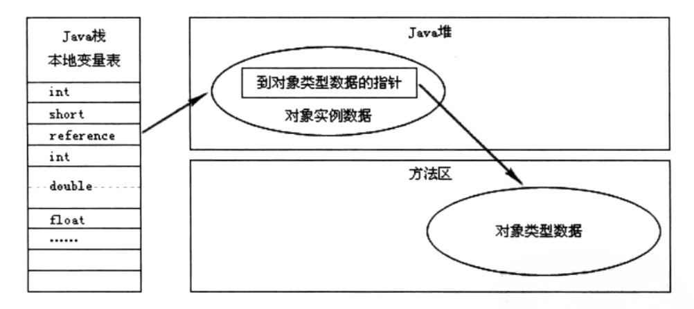

<svg id="kity_svg_6" xmlns="http://www.w3.org/2000/svg" xmlns:xlink="http://www.w3.org/1999/xlink" version="1.1" width="1196" height="628" style="visibility: visible; background: rgb(251, 251, 251);" viewBox="0 0 1196 628"><defs id="kity_defs_7"><linearGradient id="kity_linearGradient_17" x1="0" y1="0" x2="0" y2="1"><stop id="kity_stop_18" offset="0" stop-color="rgb(255, 255, 255)"></stop><stop id="kity_stop_19" offset="1" stop-color="rgb(204, 204, 204)"></stop></linearGradient><marker id="kity_marker_2" orient="auto" refX="6" refY="0" viewBox="-7 -7 14 14" markerWidth="7" markerHeight="7" markerUnits="userSpaceOnUse"><path id="kity_path_3" fill="rgb(115, 161, 191)" stroke="none" d="M6,0A6,6,0,1,1,-6,0A6,6,0,1,1,6,0"></path></marker></defs><g id="kity_g_8"><g id="minder1" text-rendering="geometricPrecision"><g id="minder_connect_group1"><path id="kity_path_31" fill="none" stroke="rgb(115, 161, 191)" stroke-width="1" d="M172,331.5A269.5,144,0,0,1,441.5,187.5"></path><path id="kity_path_33" fill="none" stroke="rgb(115, 161, 191)" stroke-width="1" d="M600.5,187.5C620.5,187.5,620.5,83.5,640.5,83.5"></path><path id="kity_path_35" fill="none" stroke="rgb(115, 161, 191)" stroke-width="1" d="M708.5,83.5C728.5,83.5,728.5,31.5,748.5,31.5"></path><path id="kity_path_37" fill="none" stroke="rgb(115, 161, 191)" stroke-width="1" d="M708.5,83.5C728.5,83.5,728.5,83.5,748.5,83.5"></path><path id="kity_path_39" fill="none" stroke="rgb(115, 161, 191)" stroke-width="1" d="M708.5,83.5C728.5,83.5,728.5,135.5,748.5,135.5"></path><path id="kity_path_41" fill="none" stroke="rgb(115, 161, 191)" stroke-width="1" d="M600.5,187.5C620.5,187.5,620.5,213.5,640.5,213.5"></path><path id="kity_path_43" fill="none" stroke="rgb(115, 161, 191)" stroke-width="1" d="M708.5,213.5C728.5,213.5,728.5,187.5,748.5,187.5"></path><path id="kity_path_45" fill="none" stroke="rgb(115, 161, 191)" stroke-width="1" d="M708.5,213.5C728.5,213.5,728.5,239.5,748.5,239.5"></path><path id="kity_path_47" fill="none" stroke="rgb(115, 161, 191)" stroke-width="1" d="M897.5,239.5C917.5,239.5,917.5,239.5,937.5,239.5"></path><path id="kity_path_49" fill="none" stroke="rgb(115, 161, 191)" stroke-width="1" d="M600.5,187.5C620.5,187.5,620.5,291.5,640.5,291.5"></path><path id="kity_path_51" fill="none" stroke="rgb(115, 161, 191)" stroke-width="1" d="M684.5,291.5C704.5,291.5,704.5,291.5,724.5,291.5"></path><path id="kity_path_53" fill="none" stroke="rgb(115, 161, 191)" stroke-width="1" d="M172,331.5A269.5,144,0,0,0,441.5,475.5"></path><path id="kity_path_55" fill="none" stroke="rgb(115, 161, 191)" stroke-width="1" d="M562.5,475.5C582.5,475.5,582.5,402.5,602.5,402.5"></path><path id="kity_path_57" fill="none" stroke="rgb(115, 161, 191)" stroke-width="1" d="M562.5,475.5C582.5,475.5,582.5,550,602.5,550"></path></g><g id="minder_node1"><path id="node_outline1" fill="rgb(115, 161, 191)" stroke="rgb(57, 80, 96)" d="M25.5,311.5h293a5,5,0,0,1,5,5v30a5,5,0,0,1,-5,5h-293a5,5,0,0,1,-5,-5v-30a5,5,0,0,1,5,-5z" stroke-width="3"></path><g id="node_text1" fill="white"><text id="kity_text_22" text-rendering="inherit" font-size="16" dy=".8em" y="323.5" x="44.5">第2章 Java内存区域与内存溢出异常</text></g></g><g id="kity_g_12"><path id="kity_path_13" fill="none" stroke="none" d="M44.5,331.5h0v0h0z"></path></g><g id="kity_g_14"><path id="kity_path_15" fill="none" stroke="none" d="M44.5,331.5h0v0h0z"></path><path id="kity_path_16" fill="none" stroke="none"></path></g><g id="minder_node2"><g id="node_expander11" style="cursor: pointer;"><path id="kity_path_133" fill="white" stroke="gray" d="M442.5,187.5A6,6,0,1,1,430.5,187.5A6,6,0,1,1,442.5,187.5"></path><path id="kity_path_134" fill="none" stroke="gray" d="M432,187.5L441,187.5"></path></g><path id="node_outline12" fill="rgb(238, 243, 246)" stroke="rgb(115, 161, 191)" d="M446.5,174.5h151a3,3,0,0,1,3,3v20a3,3,0,0,1,-3,3h-151a3,3,0,0,1,-3,-3v-20a3,3,0,0,1,3,-3z" stroke-width="1"></path><g id="node_text12" fill="black"><text id="kity_text_79" text-rendering="inherit" font-size="14" dy=".8em" y="180.5" x="463.5">2.2运行时数据区域</text></g></g><g id="minder_node3"><g id="node_expander4" style="cursor: pointer;"><path id="kity_path_112" fill="white" stroke="gray" d="M640.5,83.5A6,6,0,1,1,628.5,83.5A6,6,0,1,1,640.5,83.5"></path><path id="kity_path_113" fill="none" stroke="gray" d="M630,83.5L639,83.5"></path></g><path id="node_outline5" fill="none" stroke="none" d="M645.5,72.5h58a5,5,0,0,1,5,5v12a5,5,0,0,1,-5,5h-58a5,5,0,0,1,-5,-5v-12a5,5,0,0,1,5,-5z"></path><g id="node_text5" fill="black"><text id="kity_text_65" text-rendering="inherit" font-size="12" dy=".8em" y="77.5" x="650.5">线程独立</text></g></g><g id="minder_node4"><g id="node_expander1" style="cursor: pointer;" display="none"><path id="kity_path_103" fill="white" stroke="gray" d="M748.5,31.5A6,6,0,1,1,736.5,31.5A6,6,0,1,1,748.5,31.5"></path><path id="kity_path_104" fill="none" stroke="gray"></path></g><path id="node_outline2" fill="none" stroke="none" d="M753.5,20.5h234a5,5,0,0,1,5,5v12a5,5,0,0,1,-5,5h-234a5,5,0,0,1,-5,-5v-12a5,5,0,0,1,5,-5z"></path><g id="node_text2" fill="black"><text id="kity_text_59" text-rendering="inherit" font-size="12" dy=".8em" y="25.5" x="758.5">程序计数器（Program Counter Register）</text></g></g><g id="minder_node5"><g id="node_expander2" style="cursor: pointer;" display="none"><path id="kity_path_106" fill="white" stroke="gray" d="M748.5,83.5A6,6,0,1,1,736.5,83.5A6,6,0,1,1,748.5,83.5"></path><path id="kity_path_107" fill="none" stroke="gray"></path></g><path id="node_outline3" fill="none" stroke="none" d="M753.5,72.5h211a5,5,0,0,1,5,5v12a5,5,0,0,1,-5,5h-211a5,5,0,0,1,-5,-5v-12a5,5,0,0,1,5,-5z"></path><g id="node_text3" fill="black"><text id="kity_text_61" text-rendering="inherit" font-size="12" dy=".8em" y="77.5" x="758.5">本地方法栈（Native Method Stacks）</text></g></g><g id="minder_node6"><g id="node_expander3" style="cursor: pointer;" display="none"><path id="kity_path_109" fill="white" stroke="gray" d="M748.5,135.5A6,6,0,1,1,736.5,135.5A6,6,0,1,1,748.5,135.5"></path><path id="kity_path_110" fill="none" stroke="gray"></path></g><path id="node_outline4" fill="none" stroke="none" d="M753.5,124.5h233a5,5,0,0,1,5,5v12a5,5,0,0,1,-5,5h-233a5,5,0,0,1,-5,-5v-12a5,5,0,0,1,5,-5z"></path><g id="node_text4" fill="black"><text id="kity_text_63" text-rendering="inherit" font-size="12" dy=".8em" y="129.5" x="758.5">虚拟机栈（Java Virtual Machine Stacks）</text></g></g><g id="minder_node7"><g id="node_expander8" style="cursor: pointer;"><path id="kity_path_124" fill="white" stroke="gray" d="M640.5,213.5A6,6,0,1,1,628.5,213.5A6,6,0,1,1,640.5,213.5"></path><path id="kity_path_125" fill="none" stroke="gray" d="M630,213.5L639,213.5"></path></g><path id="node_outline9" fill="none" stroke="none" d="M645.5,202.5h58a5,5,0,0,1,5,5v12a5,5,0,0,1,-5,5h-58a5,5,0,0,1,-5,-5v-12a5,5,0,0,1,5,-5z"></path><g id="node_text9" fill="black"><text id="kity_text_73" text-rendering="inherit" font-size="12" dy=".8em" y="207.5" x="650.5">线程共享</text></g></g><g id="minder_node8"><g id="node_expander5" style="cursor: pointer;" display="none"><path id="kity_path_115" fill="white" stroke="gray" d="M748.5,187.5A6,6,0,1,1,736.5,187.5A6,6,0,1,1,748.5,187.5"></path><path id="kity_path_116" fill="none" stroke="gray"></path></g><path id="node_outline6" fill="none" stroke="none" d="M753.5,176.5h129a5,5,0,0,1,5,5v12a5,5,0,0,1,-5,5h-129a5,5,0,0,1,-5,-5v-12a5,5,0,0,1,5,-5z"></path><g id="node_text6" fill="black"><text id="kity_text_67" text-rendering="inherit" font-size="12" dy=".8em" y="181.5" x="758.5">Java堆（Java Heap）</text></g></g><g id="minder_node9"><g id="node_expander7" style="cursor: pointer;"><path id="kity_path_121" fill="white" stroke="gray" d="M748.5,239.5A6,6,0,1,1,736.5,239.5A6,6,0,1,1,748.5,239.5"></path><path id="kity_path_122" fill="none" stroke="gray" d="M738,239.5L747,239.5"></path></g><path id="node_outline8" fill="none" stroke="none" d="M753.5,228.5h139a5,5,0,0,1,5,5v12a5,5,0,0,1,-5,5h-139a5,5,0,0,1,-5,-5v-12a5,5,0,0,1,5,-5z"></path><g id="node_text8" fill="black"><text id="kity_text_71" text-rendering="inherit" font-size="12" dy=".8em" y="233.5" x="758.5">方法区（Method Area）</text></g></g><g id="minder_node10"><g id="node_expander6" style="cursor: pointer;" display="none"><path id="kity_path_118" fill="white" stroke="gray" d="M937.5,239.5A6,6,0,1,1,925.5,239.5A6,6,0,1,1,937.5,239.5"></path><path id="kity_path_119" fill="none" stroke="gray"></path></g><path id="node_outline7" fill="none" stroke="none" d="M942.5,228.5h229a5,5,0,0,1,5,5v12a5,5,0,0,1,-5,5h-229a5,5,0,0,1,-5,-5v-12a5,5,0,0,1,5,-5z"></path><g id="node_text7" fill="black"><text id="kity_text_69" text-rendering="inherit" font-size="12" dy=".8em" y="233.5" x="947.5">运行时常量池（Runtime Constant Pool）</text></g></g><g id="minder_node11"><g id="node_expander10" style="cursor: pointer;"><path id="kity_path_130" fill="white" stroke="gray" d="M640.5,291.5A6,6,0,1,1,628.5,291.5A6,6,0,1,1,640.5,291.5"></path><path id="kity_path_131" fill="none" stroke="gray" d="M630,291.5L639,291.5"></path></g><path id="node_outline11" fill="none" stroke="none" d="M645.5,280.5h34a5,5,0,0,1,5,5v12a5,5,0,0,1,-5,5h-34a5,5,0,0,1,-5,-5v-12a5,5,0,0,1,5,-5z"></path><g id="node_text11" fill="black"><text id="kity_text_77" text-rendering="inherit" font-size="12" dy=".8em" y="285.5" x="650.5">特殊</text></g></g><g id="minder_node12"><g id="node_expander9" style="cursor: pointer;" display="none"><path id="kity_path_127" fill="white" stroke="gray" d="M724.5,291.5A6,6,0,1,1,712.5,291.5A6,6,0,1,1,724.5,291.5"></path><path id="kity_path_128" fill="none" stroke="gray"></path></g><path id="node_outline10" fill="none" stroke="none" d="M729.5,280.5h160a5,5,0,0,1,5,5v12a5,5,0,0,1,-5,5h-160a5,5,0,0,1,-5,-5v-12a5,5,0,0,1,5,-5z"></path><g id="node_text10" fill="black"><text id="kity_text_75" text-rendering="inherit" font-size="12" dy=".8em" y="285.5" x="734.5">直接内存（Direct Memory）</text></g></g><g id="minder_node13"><g id="node_expander14" style="cursor: pointer;"><path id="kity_path_142" fill="white" stroke="gray" d="M442.5,475.5A6,6,0,1,1,430.5,475.5A6,6,0,1,1,442.5,475.5"></path><path id="kity_path_143" fill="none" stroke="gray" d="M432,475.5L441,475.5"></path></g><path id="node_outline15" fill="rgb(238, 243, 246)" stroke="rgb(115, 161, 191)" d="M446.5,462.5h113a3,3,0,0,1,3,3v20a3,3,0,0,1,-3,3h-113a3,3,0,0,1,-3,-3v-20a3,3,0,0,1,3,-3z" stroke-width="1"></path><g id="node_text15" fill="black"><text id="kity_text_85" text-rendering="inherit" font-size="14" dy=".8em" y="468.5" x="463.5">2.3 对象访问 </text></g></g><g id="minder_node14"><g id="node_expander12" style="cursor: pointer;" display="none"><path id="kity_path_136" fill="white" stroke="gray" d="M602.5,402.5A6,6,0,1,1,590.5,402.5A6,6,0,1,1,602.5,402.5"></path><path id="kity_path_137" fill="none" stroke="gray"></path></g><path id="node_outline13" fill="none" stroke="none" d="M607.5,343.5h210a5,5,0,0,1,5,5v108a5,5,0,0,1,-5,5h-210a5,5,0,0,1,-5,-5v-108a5,5,0,0,1,5,-5z"></path><g id="node_text13" fill="black"><text id="kity_text_81" text-rendering="inherit" font-size="12" dy=".8em" y="444.5" x="700.5">句柄</text></g><image id="kity_image_86" xmlns:xlink="http://www.w3.org/1999/xlink" xlink:href="http://kityminder-img.gz.bcebos.com/c8e0155a56c287d48c84d051b906f343874e960f" x="612.5" y="348.5" width="200" height="91"></image></g><g id="minder_node15"><g id="node_expander13" style="cursor: pointer;" display="none"><path id="kity_path_139" fill="white" stroke="gray" d="M602.5,550A6,6,0,1,1,590.5,550A6,6,0,1,1,602.5,550"></path><path id="kity_path_140" fill="none" stroke="gray"></path></g><path id="node_outline14" fill="none" stroke="none" d="M607.5,491.5h210a5,5,0,0,1,5,5v107a5,5,0,0,1,-5,5h-210a5,5,0,0,1,-5,-5v-107a5,5,0,0,1,5,-5z"></path><g id="node_text14" fill="black"><text id="kity_text_83" text-rendering="inherit" font-size="12" dy=".8em" y="591.5" x="688.5">直接指针</text></g><image id="kity_image_87" xmlns:xlink="http://www.w3.org/1999/xlink" xlink:href="http://kityminder-img.gz.bcebos.com/5123acbd9eaad8bad07c4a7eead06f3ed39d2abe" x="612.5" y="496.5" width="200" height="90"></image></g></g></g></svg>

## 2.2运行时数据区域

### 线程独立

#### 程序计数器（Program Counter Register）
- 当前线程的字节码行号指示器
- 分支、循环、跳转、异常处理、线程回复等依赖计数器来完成
- 唯一一个在Java虚拟机规范中没有规定任何OutOfMemoryError情况的区域
#### 虚拟机栈（Java Virtual Machine Stacks）
- 每个方法被执行时都会创建一个栈帧
- 用于存储局部变量表、操作栈、动态方法链接、方法出口等信息
- 如果线程请求的栈深度大于虚拟机所允许的深度，将抛出StackOverflowError异常
- 如果扩展时无法申请到足够的内存时会抛出OutOfMemoryError异常
#### 本地方法栈（Native Method Stacks）
- 为Native方法服务

### 线程共享

#### Java堆（Java Heap）
- 通常是虚拟机锁管理的内存中最大的
- 几乎所有对象实例以及数组在堆上分配（栈上分配、标量替换）
- 垃圾收集器管理的主要区域
- 逻辑上是连续的
- 堆中没有完成实例分配，且堆无法扩展时，抛出OutOfMemoryError异常
#### 方法区（Method Area）
- 存储加载的类信息、常量、静态变量、即时编译器编译后的代码等
- 垃圾回收行为很少出现，主要针对常量池的回收和类型卸载
- 无法满足内存分配需求时，将抛出OutOfMemoryError异常
##### 运行时常量池（Runtime Constant Pool）

### 特殊

#### 直接内存（Direct Memory）

## 2.3 对象访问 

### 句柄

### 直接指针

